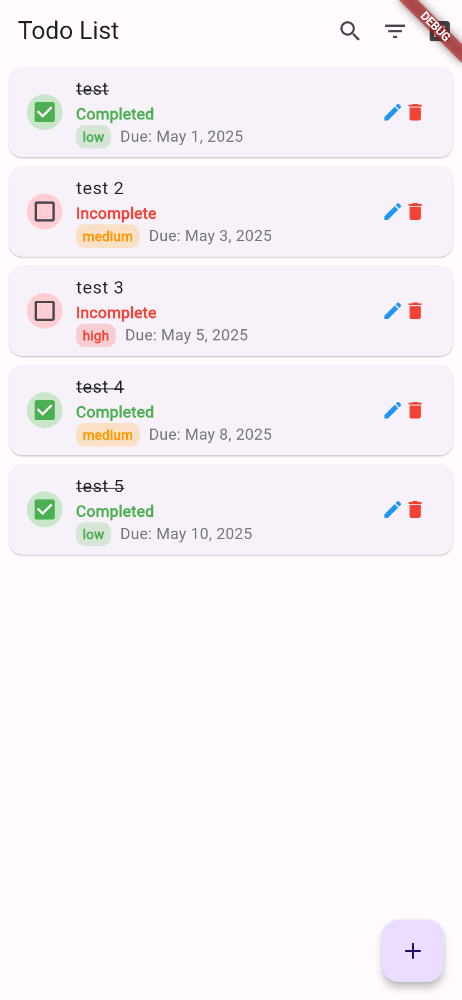
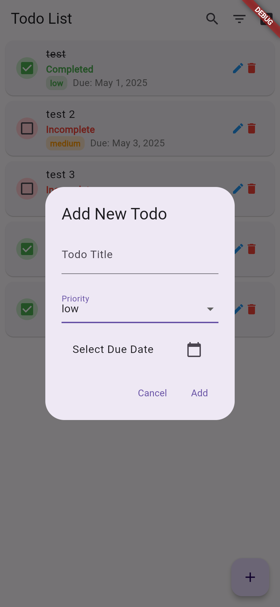
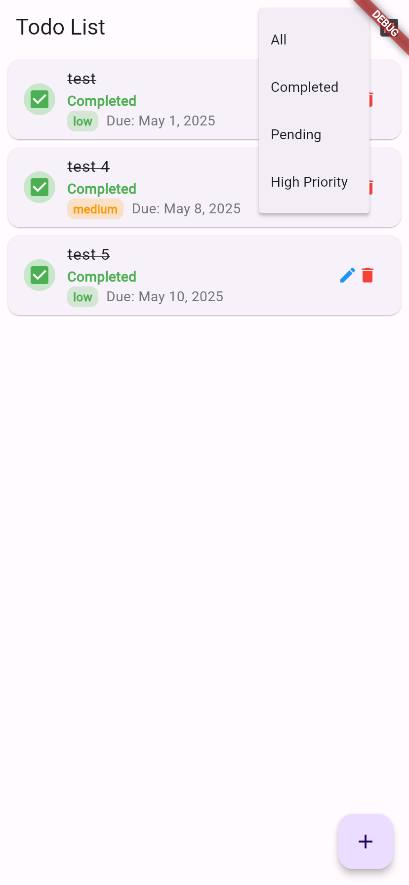
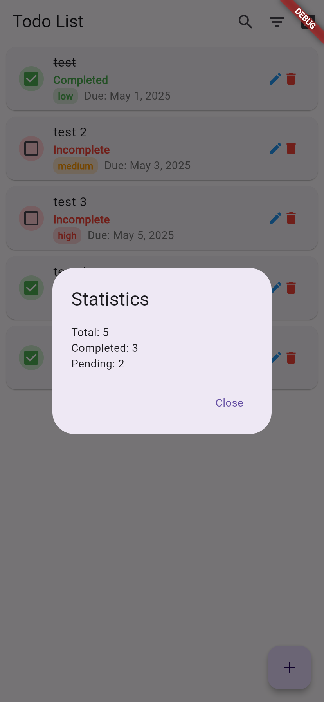

# flutter_front_demo

A new Flutter project.

## Getting Started

This project is a starting point for a Flutter application.

A few resources to get you started if this is your first Flutter project:

- [Lab: Write your first Flutter app](https://docs.flutter.dev/get-started/codelab)
- [Cookbook: Useful Flutter samples](https://docs.flutter.dev/cookbook)

For help getting started with Flutter development, view the
[online documentation](https://docs.flutter.dev/), which offers tutorials,
samples, guidance on mobile development, and a full API reference.

# Flutter Todo App

A modern Todo application with rich features and clean UI.

## Screenshots

  
  
  
  

## Features
- ✅ Create, Read, Update, Delete todos
- 🔍 Search functionality
- ⭐ Priority levels (high, medium, low)
- 📅 Due dates
- 🔄 Filtering by status and priority
- 📊 Statistics view
- 💫 Modern UI with smooth animations
- 📱 Responsive design

## Getting Started
1. Clone the repository
2. Run `flutter pub get`
3. Start the backend server
4. Run `flutter run`